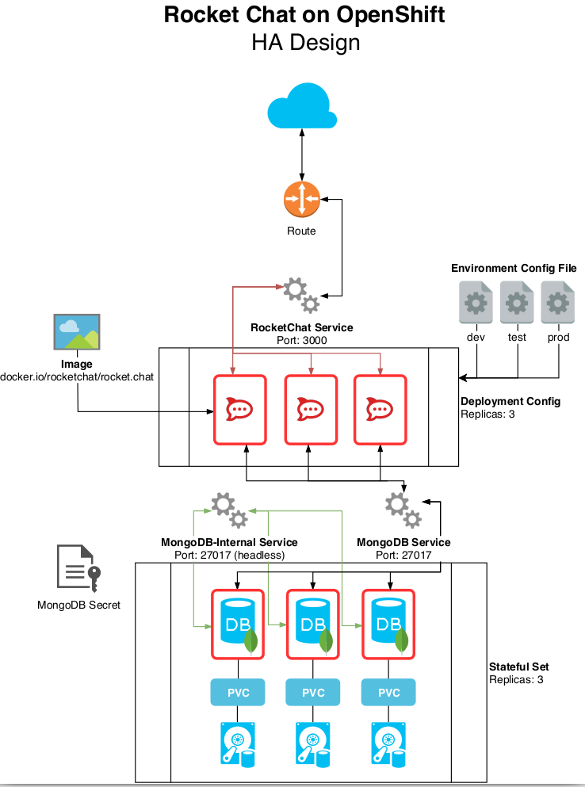
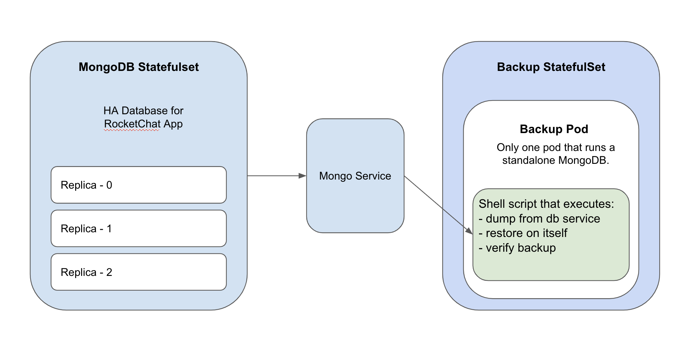

# code-challenge
Code challenge assignment from Shelly a.k.a Xue Han.

# 1) Application Deployment

The deployed objects together serve as the `Maintenance Instance` for BCGov Production RocketChat (RC), with Ansible automation and High Availability. This Maintenance instance includes the latest stable RC app and MongoDb as the database, hosted on OpenShift. Running version of the application is available here: https://rocketchat-maintenance.pathfinder.gov.bc.ca

If you are interested in the ideas, thoughts, and background for this application setup, see [here](docs/background.md).

As for now, this instance is living on the OpenShift cluster where the prod RC is. `Ansible Playbook` automation makes it easy to migrate once a cloud cluster is ready (as one of the task for my next sprint :P). Following are what to expect from the Ansible Playbook.

***RUN:***

- Deploy with Ansible Playbook, detail steps [here](ansible/README.md).
- Manual deployment is also available if needed (but not recommended). See [here](.openshift/README.md) for more details.

***MORE details on the deployment and setup:***

TL;DR but it's [here](docs/part-1.md)

***Tracking the work:***

Trello board created to break down all the tasks and made easy to track progress. There are still some minor tasks to complete to further improve this assignment. See here: https://trello.com/b/hedKqKK2/code-challenge

***STRUCTURE:***

(Image from https://github.com/BCDevOps/platform-services/blob/master/apps/rocketchat/RocketChat-MongoDB-HA-Design.png)

# 2) Operational Plan Development

Anisble Playbook to automate the MongoDB backup-restore tasks, and verify if the restore is successful.

***RUN:***

- Ansible deployment is available [here](ansible/README.md).

***STRUCTURE:***

***TASKS:***

The operational plan contains the following tasks:

- Create a new StatefulSet for MongoDB with only one pod
- Run default mongo server during startup
- Verify MongoDB service ready

- Run the script to do the following MongoDB tasks:
  - Get a dump from target database
  - Save in the mounted path with timestamp
  - Restore the data on local db
  - Mongo shell to verify the RocketChat database exists already

- Scale down the backup instance after completed

***Reason for this approach:***

The backup strategy was not completed for the production MongDB StatefulSet. There is only backup being created, but was never tested for restoring. So that comes the idea to extend the functionality with `restore` and `verify` steps. 

This operational plan is designed for the maintenance instance (but it would be easily modified to fit production database backup well). See the following reasoning:
- Why Ansible:
  - Nice automation, could be easily configured to apply for production MongoDB backup strategy
  - Consistent with deployment
  - Extra points!

- Why a StatefulSet:
  - Currently not running as CronJob, because the Maintenance instance is not heavily used and should be easy to teardown and bring up
  - But for production RC, a CroJob with daily backups should be created
  - StatefulSet provides a predictable pod name for executions

- Why not `nfs-backup` backup volume:
  - Using a `netapp-block-standard` as this data preservation is just a nice-to-have
  - But for production backups, we should use nfs instead to separate from cluster

- Why no use existing tools for OpenShift setup, like backup-container:
  - A bit over kill for this simple task and not enough customization

# 3) Bonus Round

Production RocketChat instance upgrade and migration plan, plus some security concerns. See [here](docs/part-3.md).
